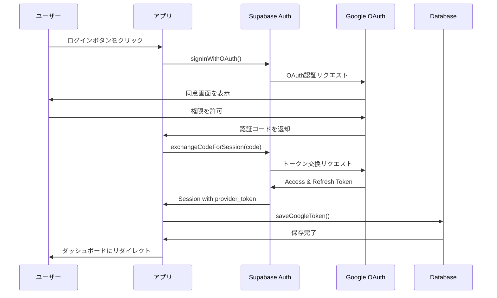

# Google OAuth Token管理

このドキュメントでは、Google OAuth TokenをSupabaseデータベースに保存・管理する仕組みについて説明します。

## 概要

ユーザーがGoogle OAuthでログインすると、以下のTokenが取得されます：

- **Access Token** (`provider_token`): Google APIへのアクセスに使用（有効期限: 1時間）
- **Refresh Token** (`provider_refresh_token`): Access Tokenの更新に使用（長期有効）

これらのTokenを`user_tokens`テーブルに保存することで、以下が可能になります：

1. ユーザーがログインしていない状態でもGoogle My Business APIを呼び出せる
2. Access Tokenの有効期限が切れた際、自動的にRefresh Tokenで更新できる
3. バックグラウンドでレビュー情報を定期的に同期できる

## データベース構造

### `user_tokens` テーブル

| カラム名 | 型 | 説明 |
|---------|-----|------|
| `id` | UUID | 主キー |
| `user_id` | UUID | auth.usersテーブルへの外部キー |
| `provider` | TEXT | プロバイダー名（'google'） |
| `access_token` | TEXT | Google Access Token |
| `refresh_token` | TEXT | Google Refresh Token（nullable） |
| `expires_at` | TIMESTAMPTZ | Access Tokenの有効期限 |
| `created_at` | TIMESTAMPTZ | レコード作成日時 |
| `updated_at` | TIMESTAMPTZ | レコード更新日時 |

**制約:**
- `(user_id, provider)` の組み合わせは一意（UNIQUE制約）
- `user_id` は `auth.users(id)` への外部キー（CASCADE DELETE）

**セキュリティ:**
- Row Level Security (RLS) が有効
- ユーザーは自分のTokenのみ閲覧・更新・削除可能

## セットアップ手順

### 1. データベースマイグレーションの実行

Supabase Dashboardまたはローカル環境でマイグレーションを実行します。

#### Supabase Dashboardで実行する場合

1. [Supabase Dashboard](https://supabase.com/dashboard) を開く
2. プロジェクトを選択
3. 左側メニューから「SQL Editor」を選択
4. `supabase/migrations/001_create_user_tokens.sql` の内容をコピー＆ペースト
5. 「Run」をクリックして実行

#### ローカル環境で実行する場合（Supabase CLI使用）

```bash
# Supabase CLIがインストールされていない場合
npm install -g supabase

# Supabaseプロジェクトにリンク
supabase link --project-ref your-project-ref

# マイグレーションを実行
supabase db push
```

### 2. 動作確認

1. アプリケーションを起動: `npm run dev`
2. ログインページで「Googleでログイン」をクリック
3. Google OAuth同意画面で権限を許可
4. ダッシュボードにリダイレクトされることを確認
5. Supabase Dashboardの「Table Editor」で`user_tokens`テーブルを開く
6. 新しいレコードが作成されていることを確認

## Token管理API

### Token保存

**重要**: `saveGoogleToken`は認証済みのSupabaseクライアントを引数として受け取ります。これにより、RLS（Row Level Security）ポリシーが正しく機能します。

```typescript
import { saveGoogleToken } from '@/lib/api/tokens';
import { createClient } from '@/lib/supabase/server';

const supabase = await createClient();

await saveGoogleToken({
  supabase, // 認証済みのクライアントを渡す（重要）
  userId: 'user-uuid',
  accessToken: 'ya29.a0...',
  refreshToken: '1//0g...', // nullの場合は既存の値を保持
  expiresAt: 1234567890, // Unix timestamp (seconds)
});
```

**Refresh Token保持の仕組み**:
- 初回ログイン時: Googleから`refresh_token`が送られてくるので保存
- 2回目以降のログイン時: `refresh_token`は通常送られてこない（nullまたはundefined）
- この場合、既存のDBに保存されている`refresh_token`を自動的に保持
- これにより、貴重なRefresh Tokenが消失することを防ぎます

### Token取得

```typescript
import { getGoogleToken } from '@/lib/api/tokens';

// オプション1: 新しいクライアントを自動作成
const token = await getGoogleToken('user-uuid');

// オプション2: 既存のクライアントを渡す（推奨）
const supabase = await createClient();
const token = await getGoogleToken('user-uuid', supabase);

if (token) {
  console.log('Access Token:', token.access_token);
  console.log('Refresh Token:', token.refresh_token);
  console.log('有効期限:', token.expires_at);
}
```

### Token削除

```typescript
import { deleteGoogleToken } from '@/lib/api/tokens';

// オプション1: 新しいクライアントを自動作成
await deleteGoogleToken('user-uuid');

// オプション2: 既存のクライアントを渡す（推奨）
const supabase = await createClient();
await deleteGoogleToken('user-uuid', supabase);
```

## 認証フロー



## Token更新の実装（今後）

Access Tokenは1時間で期限切れになるため、以下の実装が必要です：

### 1. Token有効期限チェック関数

```typescript
// lib/api/tokens.ts に追加
export async function isTokenExpired(userId: string): Promise<boolean> {
  const token = await getGoogleToken(userId);
  
  if (!token || !token.expires_at) {
    return true;
  }
  
  const expiresAt = new Date(token.expires_at);
  const now = new Date();
  
  // 5分の余裕を持たせる
  const bufferTime = 5 * 60 * 1000;
  return now.getTime() >= expiresAt.getTime() - bufferTime;
}
```

### 2. Token更新関数

```typescript
// lib/api/tokens.ts に追加
export async function refreshGoogleToken(userId: string): Promise<void> {
  const token = await getGoogleToken(userId);
  
  if (!token || !token.refresh_token) {
    throw new Error('Refresh Tokenが見つかりません');
  }
  
  // Google Token Endpointに問い合わせ
  const response = await fetch('https://oauth2.googleapis.com/token', {
    method: 'POST',
    headers: {
      'Content-Type': 'application/x-www-form-urlencoded',
    },
    body: new URLSearchParams({
      client_id: process.env.GOOGLE_CLIENT_ID!,
      client_secret: process.env.GOOGLE_CLIENT_SECRET!,
      refresh_token: token.refresh_token,
      grant_type: 'refresh_token',
    }),
  });
  
  if (!response.ok) {
    throw new Error('Token更新に失敗しました');
  }
  
  const data = await response.json();
  
  // 新しいAccess Tokenを保存
  await saveGoogleToken({
    userId,
    accessToken: data.access_token,
    refreshToken: token.refresh_token, // Refresh Tokenは変わらない
    expiresAt: Math.floor(Date.now() / 1000) + data.expires_in,
  });
}
```

### 3. API呼び出し前のToken確認

```typescript
// Google My Business APIを呼び出す前に実行
async function ensureValidToken(userId: string): Promise<string> {
  if (await isTokenExpired(userId)) {
    await refreshGoogleToken(userId);
  }
  
  const token = await getGoogleToken(userId);
  if (!token) {
    throw new Error('Tokenが見つかりません');
  }
  
  return token.access_token;
}

// 使用例
const accessToken = await ensureValidToken(userId);
const reviews = await fetchGoogleReviews(accessToken, locationId);
```

## 実装上の重要ポイント

### 1. Refresh Token保持の仕組み

**問題**: Googleは通常、初回ログイン時または`prompt=consent`を指定した時のみRefresh Tokenを送信します。2回目以降のログインではRefresh Tokenが送られてこないため、単純に上書きするとRefresh Tokenが消失してしまいます。

**解決策**: `saveGoogleToken`関数内で、新しいRefresh Tokenがnull/undefinedの場合、既存のDBに保存されているRefresh Tokenを自動的に取得して保持します。

```typescript
// lib/api/tokens.ts 内の処理
if (!refreshToken) {
  // 既存のTokenレコードを取得
  const { data: existingToken } = await supabase
    .from('user_tokens')
    .select('refresh_token')
    .eq('user_id', userId)
    .eq('provider', 'google')
    .single();
  
  // 既存のRefresh Tokenがあればそれを使用
  if (existingToken?.refresh_token) {
    finalRefreshToken = existingToken.refresh_token;
  }
}
```

### 2. RLS（Row Level Security）対策

**問題**: `saveGoogleToken`内で新しいSupabaseクライアントを作成すると、まだCookieがセットされていないため「未ログイン状態」と判定され、RLSポリシーによって保存が失敗する可能性があります。

**解決策**: コールバック処理（`route.ts`）で使用している認証済みのSupabaseクライアントを引数として渡します。

```typescript
// app/api/auth/callback/route.ts
const supabase = await createClient();
const { data } = await supabase.auth.exchangeCodeForSession(code);

// 認証済みのクライアントを渡す
await saveGoogleToken({
  supabase, // ← これが重要
  userId: user.id,
  accessToken: provider_token,
  refreshToken: provider_refresh_token || null,
  expiresAt: expires_at,
});
```

### 3. エラーハンドリング

Token保存に失敗しても、ユーザーの認証自体は成功させる設計になっています。これにより、Token保存の問題が認証フローをブロックすることを防ぎます。

```typescript
try {
  await saveGoogleToken({ ... });
} catch (tokenError) {
  // ログに記録するが、認証は継続
  console.error('❌ Token保存エラー（認証は継続）:', tokenError);
}
```

## セキュリティ考慮事項

### 1. Token暗号化（推奨）

現在、TokenはプレーンテキストでDBに保存されています。本番環境では暗号化を推奨します：

```typescript
// 暗号化の例（crypto-jsを使用）
import CryptoJS from 'crypto-js';

function encryptToken(token: string): string {
  return CryptoJS.AES.encrypt(token, process.env.ENCRYPTION_KEY!).toString();
}

function decryptToken(encryptedToken: string): string {
  const bytes = CryptoJS.AES.decrypt(encryptedToken, process.env.ENCRYPTION_KEY!);
  return bytes.toString(CryptoJS.enc.Utf8);
}
```

### 2. Row Level Security (RLS)

`user_tokens`テーブルにはRLSが設定されており、以下のポリシーが適用されています：

- ユーザーは自分のTokenのみ閲覧可能
- ユーザーは自分のTokenのみ更新可能
- ユーザーは自分のTokenのみ挿入可能
- ユーザーは自分のTokenのみ削除可能

### 3. Token漏洩対策

- Tokenをログやエラーメッセージに出力しない
- フロントエンドにTokenを送信しない
- サーバーサイドでのみToken処理を行う

## トラブルシューティング

### Token保存エラー

**症状**: ログインは成功するが、Tokenが保存されない

**原因と対処法**:

1. **マイグレーションが実行されていない**
   - Supabase Dashboardで`user_tokens`テーブルが存在するか確認
   - マイグレーションを再実行

2. **RLSポリシーの問題**
   - Supabase Dashboardの「Authentication」→「Policies」で確認
   - ポリシーが正しく設定されているか確認

3. **provider_tokenが取得できていない**
   - Google Cloud Consoleでスコープが正しく設定されているか確認
   - `access_type: 'offline'` と `prompt: 'consent'` が設定されているか確認

### Refresh Tokenが取得できない

**症状**: `provider_refresh_token`がnullになる

**対処法**:

1. OAuth設定を確認:
   ```typescript
   queryParams: {
     access_type: 'offline', // 必須
     prompt: 'consent',      // 必須
   }
   ```

2. Googleで再度認証:
   - 既に認証済みの場合、Refresh Tokenが発行されないことがある
   - Googleアカウントの「アクセス権を持つアプリ」からアプリを削除
   - 再度ログインして権限を許可

## 参考資料

- [Supabase Auth - OAuth Providers](https://supabase.com/docs/guides/auth/social-login)
- [Google OAuth 2.0 for Server-side Apps](https://developers.google.com/identity/protocols/oauth2/web-server)
- [Google My Business API](https://developers.google.com/my-business)
