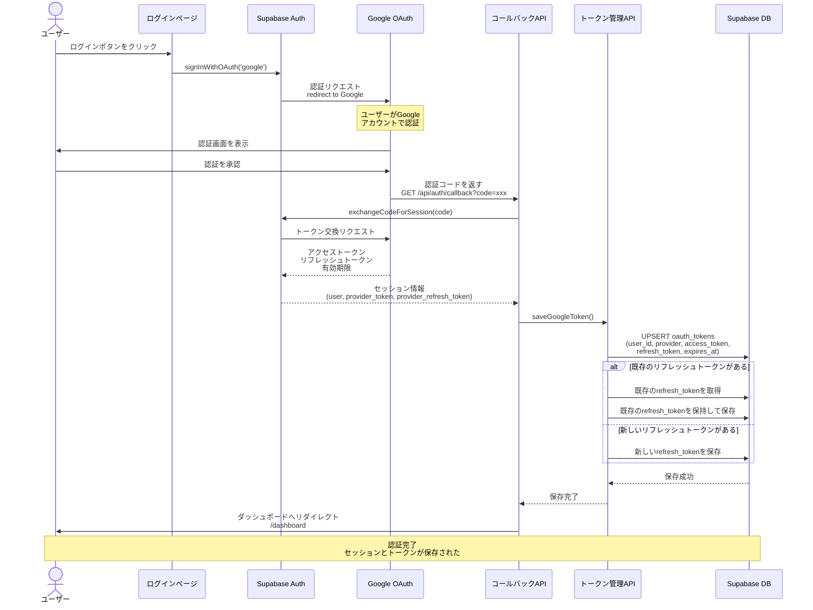

# 認証フロー (Authentication Flow)

## 概要

Google OAuth 2.0を使用したユーザー認証とトークン管理のシーケンス図です。Supabase Authを経由してGoogle認証を行い、アクセストークンとリフレッシュトークンをデータベースに保存します。

## 関連ファイル

- [`app/login/page.tsx`](../../app/login/page.tsx) - ログインページUI
- [`app/api/auth/callback/route.ts`](../../app/api/auth/callback/route.ts) - OAuth コールバック処理
- [`lib/api/google-oauth.ts`](../../lib/api/google-oauth.ts) - Google OAuth ユーティリティ
- [`lib/api/tokens.ts`](../../lib/api/tokens.ts) - トークン管理（保存・取得・更新）
- [`lib/supabase/server.ts`](../../lib/supabase/server.ts) - Supabase サーバークライアント

## アーキテクチャ図

```mermaid
graph TB
    User[ユーザー]
    LoginPage[ログインページ]
    SupabaseAuth[Supabase Auth]
    GoogleOAuth[Google OAuth 2.0]
    CallbackAPI[/api/auth/callback<br/>APIルート]
    TokensAPI[トークン管理API<br/>saveGoogleToken]
    DB[(Supabase DB<br/>oauth_tokens テーブル)]

    User -->|ログインボタンをクリック| LoginPage
    LoginPage -->|signInWithOAuth google| SupabaseAuth
    SupabaseAuth -->|認証リクエスト| GoogleOAuth
    GoogleOAuth -->|認証画面を表示| User
    User -->|認証を承認| GoogleOAuth
    GoogleOAuth -->|認証コードを返す| CallbackAPI
    CallbackAPI -->|exchangeCodeForSession| SupabaseAuth
    SupabaseAuth -->|トークン交換リクエスト| GoogleOAuth
    GoogleOAuth -->|アクセストークン<br/>リフレッシュトークン| SupabaseAuth
    SupabaseAuth -->|セッション情報| CallbackAPI
    CallbackAPI -->|saveGoogleToken| TokensAPI
    TokensAPI -->|UPSERT oauth_tokens| DB
    DB -->|保存完了| TokensAPI
    TokensAPI -->|保存完了| CallbackAPI
    CallbackAPI -->|ダッシュボードへリダイレクト| User

    style User fill:#e1f5ff
    style LoginPage fill:#fff4e1
    style SupabaseAuth fill:#e1ffe1
    style GoogleOAuth fill:#ffe1f0
    style CallbackAPI fill:#ffe1e1
    style TokensAPI fill:#f0e1ff
    style DB fill:#e1ffe1
```

## シーケンス図



## 処理フロー詳細

### 1. ログイン開始

```typescript
// app/login/page.tsx
const handleGoogleLogin = async () => {
  const supabase = createClient();
  await supabase.auth.signInWithOAuth({
    provider: 'google',
    options: {
      redirectTo: `${window.location.origin}/api/auth/callback`,
      scopes: 'https://www.googleapis.com/auth/business.manage',
    },
  });
};
```

### 2. コールバック処理

```typescript
// app/api/auth/callback/route.ts
export async function GET(request: NextRequest) {
  const code = requestUrl.searchParams.get('code');
  
  if (code) {
    const supabase = await createClient();
    const { data, error } = await supabase.auth.exchangeCodeForSession(code);
    
    if (data.session) {
      const { user, provider_token, provider_refresh_token, expires_at } = data.session;
      
      // トークンをDBに保存
      await saveGoogleToken({
        supabase,
        userId: user.id,
        accessToken: provider_token,
        refreshToken: provider_refresh_token,
        expiresAt: expires_at,
      });
    }
    
    return NextResponse.redirect(new URL('/dashboard', request.url));
  }
}
```

### 3. トークン保存

```typescript
// lib/api/tokens.ts
export async function saveGoogleToken(params: SaveTokenParams): Promise<void> {
  const { supabase, userId, accessToken, refreshToken, expiresAt } = params;
  
  // リフレッシュトークンがない場合は既存の値を保持
  let finalRefreshToken = refreshToken;
  
  if (!refreshToken) {
    const { data: existingToken } = await supabase
      .from('oauth_tokens')
      .select('refresh_token')
      .eq('user_id', userId)
      .eq('provider', 'google')
      .single();
    
    if (existingToken?.refresh_token) {
      finalRefreshToken = existingToken.refresh_token;
    }
  }
  
  await supabase
    .from('oauth_tokens')
    .upsert({
      user_id: userId,
      provider: 'google',
      access_token: accessToken,
      refresh_token: finalRefreshToken,
      expires_at: expiresAtTimestamp,
    }, {
      onConflict: 'user_id,provider',
    });
}
```

## 重要なポイント

### 1. リフレッシュトークンの保持

Google OAuthは初回認証時のみリフレッシュトークンを返します。2回目以降の認証では返されないため、既存のリフレッシュトークンを保持する必要があります。

```typescript
// リフレッシュトークンがない場合は既存の値を保持
if (!refreshToken) {
  const existingToken = await getExistingRefreshToken(userId);
  finalRefreshToken = existingToken?.refresh_token;
}
```

### 2. UPSERT による重複防止

`user_id` と `provider` の組み合わせで一意制約を設定し、UPSERTで重複を防ぎます。

```typescript
{
  onConflict: 'user_id,provider', // 重複時は更新
}
```

### 3. セキュリティ

- トークンはSupabase DBに暗号化して保存
- RLS（Row Level Security）により、ユーザーは自分のトークンのみアクセス可能
- HTTPS通信で通信内容を保護

## エラーハンドリング

### 認証エラー

```typescript
if (error) {
  return NextResponse.redirect(
    new URL(`/login?error=${encodeURIComponent(error)}`, request.url)
  );
}
```

### セッション取得失敗

```typescript
if (!data.session) {
  return NextResponse.redirect(
    new URL('/login?error=no_session', request.url)
  );
}
```

### トークン保存エラー

```typescript
try {
  await saveGoogleToken({ ... });
} catch (tokenError) {
  // エラーをログに記録するが、認証フローは継続
  console.error('Token保存エラー（認証は継続）:', tokenError);
}
```

## データベーススキーマ

### oauth_tokens テーブル

```sql
CREATE TABLE oauth_tokens (
  id UUID PRIMARY KEY DEFAULT uuid_generate_v4(),
  user_id UUID NOT NULL REFERENCES auth.users(id) ON DELETE CASCADE,
  provider TEXT NOT NULL,
  access_token TEXT NOT NULL,
  refresh_token TEXT,
  expires_at TIMESTAMPTZ,
  created_at TIMESTAMPTZ DEFAULT NOW(),
  updated_at TIMESTAMPTZ DEFAULT NOW(),
  UNIQUE(user_id, provider)
);

-- RLS ポリシー
ALTER TABLE oauth_tokens ENABLE ROW LEVEL SECURITY;

CREATE POLICY "Users can only access their own tokens"
  ON oauth_tokens FOR ALL
  USING (auth.uid() = user_id);
```

## トークンのライフサイクル

1. **初回認証**: アクセストークン + リフレッシュトークンを取得
2. **トークン保存**: DBに保存（UPSERT）
3. **トークン使用**: API呼び出し時にアクセストークンを使用
4. **トークン期限切れ**: 5分前に自動検知
5. **トークンリフレッシュ**: リフレッシュトークンで新しいアクセストークンを取得
6. **トークン更新**: 新しいアクセストークンをDBに保存

詳細は [`02_REVIEW_SYNC_FLOW.md`](./02_REVIEW_SYNC_FLOW.md) のトークンリフレッシュフローを参照してください。

## 関連ドキュメント

- [認証アーキテクチャ](../AUTHENTICATION_ARCHITECTURE.md)
- [Google トークン管理](../GOOGLE_TOKEN_MANAGEMENT.md)
- [Google 認証セットアップ](../SETUP_GOOGLE_AUTH.md)
