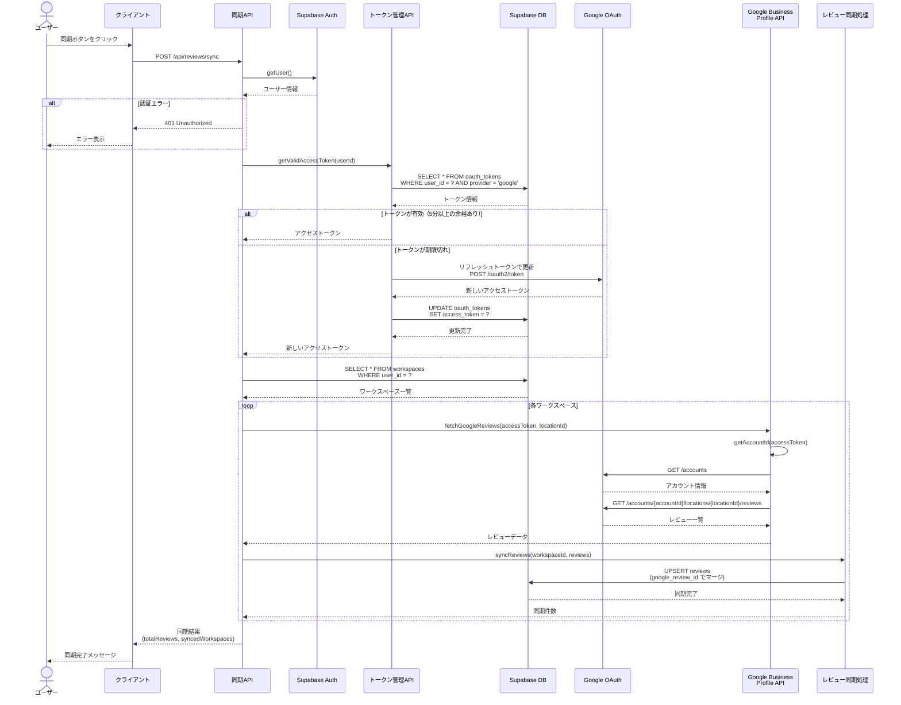

# レビュー同期フロー (Review Sync Flow)

## 概要

Google Business Profile APIからレビューを取得し、Supabase DBに同期するシーケンス図です。トークンの自動リフレッシュ機能により、期限切れのトークンを自動的に更新します。

## 関連ファイル

- [`app/api/reviews/sync/route.ts`](../../app/api/reviews/sync/route.ts) - レビュー同期APIエンドポイント
- [`lib/api/tokens.ts`](../../lib/api/tokens.ts) - トークン取得・リフレッシュ
- [`lib/api/google-mybusiness.ts`](../../lib/api/google-mybusiness.ts) - Google Business Profile API呼び出し
- [`lib/api/reviews-sync.ts`](../../lib/api/reviews-sync.ts) - DB同期処理
- [`lib/api/workspaces.ts`](../../lib/api/workspaces.ts) - ワークスペース管理

## アーキテクチャ図

```mermaid
graph TB
    User[ユーザー]
    Client[クライアント]
    SyncAPI[/api/reviews/sync<br/>APIルート]
    TokensAPI[トークン管理API<br/>getValidAccessToken]
    DB[(Supabase DB<br/>oauth_tokens<br/>workspaces<br/>reviews)]
    GoogleOAuth[Google OAuth]
    GMBAPI[Google Business<br/>Profile API]
    ReviewsSyncAPI[レビュー同期処理<br/>syncReviews]

    User -->|同期ボタンをクリック| Client
    Client -->|POST /api/reviews/sync| SyncAPI
    SyncAPI -->|アクセストークン取得| TokensAPI
    TokensAPI -->|SELECT * FROM oauth_tokens| DB
    DB -->|トークン情報| TokensAPI
    TokensAPI -.->|期限切れの場合<br/>リフレッシュ| GoogleOAuth
    GoogleOAuth -.->|新しいアクセストークン| TokensAPI
    TokensAPI -.->|UPDATE oauth_tokens| DB
    TokensAPI -->|アクセストークン| SyncAPI
    SyncAPI -->|ワークスペース一覧取得| DB
    DB -->|ワークスペース情報| SyncAPI
    SyncAPI -->|レビュー取得リクエスト| GMBAPI
    GMBAPI -->|レビュー一覧| SyncAPI
    SyncAPI -->|レビューを同期| ReviewsSyncAPI
    ReviewsSyncAPI -->|UPSERT reviews<br/>google_review_id でマージ| DB
    DB -->|同期完了| ReviewsSyncAPI
    ReviewsSyncAPI -->|同期件数| SyncAPI
    SyncAPI -->|同期結果| Client
    Client -->|同期完了メッセージ| User

    style User fill:#e1f5ff
    style Client fill:#fff4e1
    style SyncAPI fill:#ffe1e1
    style TokensAPI fill:#f0e1ff
    style DB fill:#e1ffe1
    style GoogleOAuth fill:#ffe1f0
    style GMBAPI fill:#ffe1f0
    style ReviewsSyncAPI fill:#f0e1ff
```

## シーケンス図



## 処理フロー詳細

### 1. 同期API呼び出し

```typescript
// app/api/reviews/sync/route.ts
export async function POST(request: NextRequest) {
  // 1. 認証チェック
  const supabase = await createClient();
  const { data: { user }, error: authError } = await supabase.auth.getUser();
  
  if (authError || !user) {
    return NextResponse.json({
      success: false,
      error: '認証が必要です',
    }, { status: 401 });
  }
  
  // 2. アクセストークン取得（自動リフレッシュ）
  const accessToken = await getValidAccessToken(user.id, supabase);
  
  // 3. ワークスペース一覧を取得
  const workspaces = await getWorkspaces(user.id, supabase);
  
  // 4. 各ワークスペースのレビューを同期
  let totalReviews = 0;
  for (const workspace of workspaces) {
    const reviews = await fetchGoogleReviews(accessToken, workspace.google_location_id);
    const syncedCount = await syncReviews(workspace.id, reviews, supabase);
    totalReviews += syncedCount;
  }
  
  return NextResponse.json({
    success: true,
    totalReviews,
    syncedWorkspaces: workspaces.length,
  });
}
```

### 2. トークンの自動リフレッシュ

```typescript
// lib/api/tokens.ts
export async function getValidAccessToken(
  userId: string,
  supabase?: SupabaseClient
): Promise<string> {
  const token = await getGoogleToken(userId, supabase);
  
  if (!token) {
    throw new Error('認証トークンが見つかりません');
  }
  
  // 有効期限をチェック（5分のバッファ）
  const bufferTime = 5 * 60 * 1000; // 5分
  const expiresAt = new Date(token.expires_at).getTime();
  const isValid = Date.now() < expiresAt - bufferTime;
  
  // トークンが有効ならそのまま返す
  if (isValid) {
    return token.access_token;
  }
  
  // トークンが期限切れの場合、リフレッシュ
  const { refreshAccessToken } = await import('./google-oauth');
  const refreshResult = await refreshAccessToken(token.refresh_token);
  
  // 新しいトークンをDBに保存
  await saveGoogleToken({
    supabase,
    userId,
    accessToken: refreshResult.accessToken,
    refreshToken: token.refresh_token,
    expiresAt: Math.floor(Date.now() / 1000) + refreshResult.expiresIn,
  });
  
  return refreshResult.accessToken;
}
```

### 3. Google Business Profile APIからレビュー取得

```typescript
// lib/api/google-mybusiness.ts
export async function fetchGoogleReviews(
  accessToken: string,
  locationId: string
): Promise<GoogleReview[]> {
  // アカウントIDを取得
  const accountId = await getAccountId(accessToken);
  
  // レビュー一覧を取得
  const url = `https://mybusiness.googleapis.com/v4/${accountId}/${locationId}/reviews`;
  
  const response = await fetch(url, {
    headers: {
      Authorization: `Bearer ${accessToken}`,
    },
  });
  
  if (!response.ok) {
    throw new Error(`レビュー取得に失敗: ${response.status}`);
  }
  
  const data = await response.json();
  return data.reviews || [];
}
```

### 4. DBへの同期（UPSERT）

```typescript
// lib/api/reviews-sync.ts
export async function syncReviews(
  workspaceId: string,
  reviews: GoogleReview[],
  supabase: SupabaseClient
): Promise<number> {
  const reviewsData = reviews.map(review => ({
    workspace_id: workspaceId,
    google_review_id: review.reviewId,
    rating: convertGoogleRatingToNumber(review.starRating),
    comment: review.comment || '',
    author_name: review.reviewer.displayName,
    review_created_at: review.createTime,
    reply_text: review.reviewReply?.comment || null,
    status: review.reviewReply ? 'replied' : 'unreplied',
  }));
  
  const { data, error } = await supabase
    .from('reviews')
    .upsert(reviewsData, {
      onConflict: 'google_review_id', // 重複時は更新
      ignoreDuplicates: false,
    })
    .select();
  
  return data?.length || 0;
}
```

## 重要なポイント

### 1. トークンの自動リフレッシュ

トークンの有効期限を5分前にチェックし、期限切れの場合は自動的にリフレッシュします。

```typescript
const bufferTime = 5 * 60 * 1000; // 5分のバッファ
const isValid = Date.now() < expiresAt - bufferTime;
```

**メリット:**
- API呼び出し中にトークンが期限切れになるリスクを軽減
- ユーザーに再ログインを要求しない

### 2. UPSERT による重複防止

`google_review_id` をユニークキーとして、既存レビューは更新、新規レビューは挿入します。

```typescript
{
  onConflict: 'google_review_id',
  ignoreDuplicates: false, // 既存レコードを更新
}
```

### 3. 複数ワークスペースの処理

ユーザーが複数の店舗（ワークスペース）を管理している場合、すべてのワークスペースのレビューを同期します。

```typescript
for (const workspace of workspaces) {
  const reviews = await fetchGoogleReviews(accessToken, workspace.google_location_id);
  await syncReviews(workspace.id, reviews, supabase);
}
```

### 4. RLS（Row Level Security）

Supabaseの行レベルセキュリティにより、ユーザーは自分のワークスペースのレビューのみアクセス可能です。

## エラーハンドリング

### トークン取得エラー

```typescript
try {
  accessToken = await getValidAccessToken(user.id, supabase);
} catch (tokenError) {
  return NextResponse.json({
    success: false,
    error: 'トークンの取得に失敗しました',
  }, { status: 401 });
}
```

### Google API エラー

```typescript
if (!response.ok) {
  if (response.status === 401) {
    throw new Error('認証エラー: アクセストークンが無効です');
  } else if (response.status === 403) {
    throw new Error('権限エラー: Google Business Profileへのアクセス権限がありません');
  }
  throw new Error(`レビュー取得に失敗: ${response.status}`);
}
```

### DB同期エラー

```typescript
if (error) {
  console.error('レビュー同期エラー:', error);
  throw new Error(`レビューの同期に失敗しました: ${error.message}`);
}
```

## データベーススキーマ

### reviews テーブル

```sql
CREATE TABLE reviews (
  id UUID PRIMARY KEY DEFAULT uuid_generate_v4(),
  workspace_id UUID NOT NULL REFERENCES workspaces(id) ON DELETE CASCADE,
  google_review_id TEXT UNIQUE NOT NULL,
  rating INTEGER NOT NULL CHECK (rating BETWEEN 1 AND 5),
  comment TEXT,
  author_name TEXT NOT NULL,
  author_photo_url TEXT,
  review_created_at TIMESTAMPTZ NOT NULL,
  reply_text TEXT,
  reply_created_at TIMESTAMPTZ,
  status TEXT NOT NULL DEFAULT 'unreplied',
  risk TEXT,
  ai_summary TEXT,
  ai_categories TEXT[],
  ai_risk_reason TEXT,
  reply_draft TEXT,
  created_at TIMESTAMPTZ DEFAULT NOW(),
  updated_at TIMESTAMPTZ DEFAULT NOW()
);

-- インデックス
CREATE INDEX idx_reviews_workspace_id ON reviews(workspace_id);
CREATE INDEX idx_reviews_google_review_id ON reviews(google_review_id);
CREATE INDEX idx_reviews_status ON reviews(status);
CREATE INDEX idx_reviews_created_at ON reviews(review_created_at DESC);

-- RLS ポリシー
ALTER TABLE reviews ENABLE ROW LEVEL SECURITY;

CREATE POLICY "Users can access reviews in their workspaces"
  ON reviews FOR ALL
  USING (
    workspace_id IN (
      SELECT id FROM workspaces WHERE user_id = auth.uid()
    )
  );
```

## パフォーマンス最適化

### 1. バッチ処理

複数のレビューを一度にUPSERTすることで、DB呼び出し回数を削減します。

```typescript
// 一度に全レビューをUPSERT
await supabase.from('reviews').upsert(reviewsData);
```

### 2. 並列処理（将来の改善案）

複数ワークスペースの同期を並列化することで、処理時間を短縮できます。

```typescript
// 現在: 順次処理
for (const workspace of workspaces) { ... }

// 改善案: 並列処理
await Promise.all(
  workspaces.map(workspace => syncWorkspaceReviews(workspace))
);
```

## 同期頻度

- **手動同期**: ユーザーが「同期」ボタンをクリック
- **自動同期**: 将来的にCron jobで定期実行（例: 1時間ごと）

## 関連ドキュメント

- [認証フロー](./01_AUTHENTICATION_FLOW.md) - トークン取得
- [Google トークン管理](../GOOGLE_TOKEN_MANAGEMENT.md) - トークンリフレッシュの詳細
