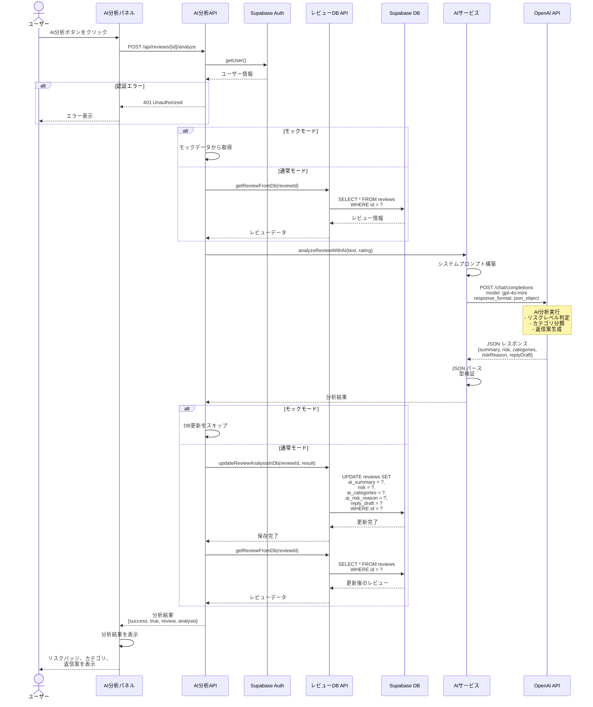

# AI分析フロー (AI Analysis Flow)

## 概要

OpenAI API (gpt-4o-mini) を使用してレビューを自動分析し、リスクレベル、カテゴリ分類、返信案を生成するシーケンス図です。

## 関連ファイル

- [`app/api/reviews/[id]/analyze/route.ts`](../../app/api/reviews/[id]/analyze/route.ts) - AI分析APIエンドポイント
- [`lib/services/ai.ts`](../../lib/services/ai.ts) - OpenAI API呼び出し
- [`lib/api/reviews-db.ts`](../../lib/api/reviews-db.ts) - DB更新処理
- [`components/reviews/ai-panel.tsx`](../../components/reviews/ai-panel.tsx) - AI分析UIコンポーネント

## アーキテクチャ図

```mermaid
graph TB
    User[ユーザー]
    AIPanelUI[AI分析パネル<br/>コンポーネント]
    AnalyzeAPI[/api/reviews/id/analyze<br/>APIルート]
    ReviewsDB[レビューDB API<br/>getReviewFromDb<br/>updateReviewAnalysisInDb]
    Supabase[(Supabase DB<br/>reviews テーブル)]
    AIService[AIサービス<br/>analyzeReviewWithAI]
    OpenAI[OpenAI API<br/>gpt-4o-mini]

    User -->|AI分析ボタンをクリック| AIPanelUI
    AIPanelUI -->|POST /api/reviews/id/analyze| AnalyzeAPI
    AnalyzeAPI -->|レビュー情報を取得| ReviewsDB
    ReviewsDB -->|SELECT * FROM reviews| Supabase
    Supabase -->|レビューデータ| ReviewsDB
    ReviewsDB -->|レビューデータ| AnalyzeAPI
    AnalyzeAPI -->|レビューテキスト 評価| AIService
    AIService -->|レビュー分析リクエスト| OpenAI
    OpenAI -->|分析結果<br/>要約 リスク カテゴリ<br/>リスク理由 返信案| AIService
    AIService -->|分析結果| AnalyzeAPI
    AnalyzeAPI -->|分析結果を保存| ReviewsDB
    ReviewsDB -->|UPDATE reviews SET<br/>ai_summary risk ai_categories| Supabase
    Supabase -->|更新完了| ReviewsDB
    ReviewsDB -->|保存完了| AnalyzeAPI
    AnalyzeAPI -->|分析結果| AIPanelUI
    AIPanelUI -->|分析結果を表示| User

    style User fill:#e1f5ff
    style AIPanelUI fill:#fff4e1
    style AnalyzeAPI fill:#ffe1e1
    style ReviewsDB fill:#e1ffe1
    style Supabase fill:#e1ffe1
    style AIService fill:#f0e1ff
    style OpenAI fill:#ffe1f0
```

## シーケンス図



## 処理フロー詳細

### 1. AI分析API呼び出し

```typescript
// app/api/reviews/[id]/analyze/route.ts
export async function POST(
  request: NextRequest,
  { params }: { params: Promise<{ id: string }> }
) {
  const { id } = await params;
  
  // 1. 認証チェック
  const supabase = await createClient();
  const { data: { user }, error: authError } = await supabase.auth.getUser();
  
  if (authError || !user) {
    return NextResponse.json({
      success: false,
      error: '認証が必要です',
    }, { status: 401 });
  }
  
  // 2. レビュー情報を取得
  const review = await getReviewFromDb(id, supabase);
  
  // 3. AI分析を実行
  const analysisResult = await analyzeReviewWithAI(
    review.comment || '',
    review.rating
  );
  
  // 4. 分析結果をDBに保存
  await updateReviewAnalysisInDb(id, analysisResult, supabase);
  
  // 5. 更新後のレビューを取得
  const updatedReview = await getReviewFromDb(id, supabase);
  
  return NextResponse.json({
    success: true,
    review: updatedReview,
    analysis: analysisResult,
  });
}
```

### 2. AI分析処理

```typescript
// lib/services/ai.ts
export async function analyzeReviewWithAI(
  reviewText: string,
  rating: number
): Promise<AIAnalysisResult> {
  const apiKey = process.env.OPENAI_API_KEY;
  
  if (!apiKey) {
    throw new Error('OPENAI_API_KEYが設定されていません');
  }
  
  const openai = new OpenAI({ apiKey });
  
  // システムプロンプト
  const systemPrompt = `あなたは日本の実店舗の経験豊富なベテラン店長です。
顧客レビューを分析し、以下のJSON形式で結果を返してください。

{
  "summary": "レビューの要約（50文字以内）",
  "risk": "high | medium | low （リスクレベル）",
  "categories": ["接客", "味", "価格", "雰囲気", "提供スピード"] から複数選択可能,
  "riskReason": "リスク判定の理由（30文字以内）",
  "replyDraft": "丁寧な返信案"
}

リスクレベルの判定基準:
- high: ★1-2かつ強い不満表現、再訪意向の喪失
- medium: ★3または具体的な改善要望
- low: ★4-5または具体的な問題なし`;
  
  const userPrompt = `評価: ★${rating}
レビュー内容:
${reviewText}`;
  
  const completion = await openai.chat.completions.create({
    model: 'gpt-4o-mini',
    messages: [
      { role: 'system', content: systemPrompt },
      { role: 'user', content: userPrompt },
    ],
    response_format: { type: 'json_object' },
    temperature: 0.7,
    max_tokens: 1000,
  });
  
  const responseContent = completion.choices[0]?.message?.content;
  const parsed = JSON.parse(responseContent);
  
  // 型検証とデフォルト値の設定
  return {
    summary: String(parsed.summary || '分析結果を取得できませんでした').substring(0, 50),
    risk: ['high', 'medium', 'low'].includes(parsed.risk) ? parsed.risk : 'medium',
    categories: Array.isArray(parsed.categories) ? parsed.categories : [],
    riskReason: String(parsed.riskReason || '').substring(0, 30),
    replyDraft: String(parsed.replyDraft || 'ご利用ありがとうございました。'),
  };
}
```

### 3. DB更新処理

```typescript
// lib/api/reviews-db.ts
export async function updateReviewAnalysisInDb(
  reviewId: string,
  analysisResult: {
    summary: string;
    risk: 'high' | 'medium' | 'low';
    categories: string[];
    riskReason: string;
    replyDraft: string;
  },
  supabase: SupabaseClient
): Promise<void> {
  const { error } = await supabase
    .from('reviews')
    .update({
      ai_summary: analysisResult.summary,
      risk: analysisResult.risk,
      ai_categories: analysisResult.categories,
      ai_risk_reason: analysisResult.riskReason,
      reply_draft: analysisResult.replyDraft,
      updated_at: new Date().toISOString(),
    })
    .eq('id', reviewId);
  
  if (error) {
    throw new Error(`DB更新に失敗しました: ${error.message}`);
  }
}
```

## 重要なポイント

### 1. JSON形式でのレスポンス

OpenAI APIに `response_format: { type: 'json_object' }` を指定することで、確実にJSON形式のレスポンスを取得します。

```typescript
{
  response_format: { type: 'json_object' },
}
```

### 2. 型検証とデフォルト値

AIのレスポンスが期待通りでない場合に備えて、型検証とデフォルト値を設定します。

```typescript
risk: ['high', 'medium', 'low'].includes(parsed.risk) ? parsed.risk : 'medium',
categories: Array.isArray(parsed.categories) ? parsed.categories : [],
```

### 3. 文字数制限

UIでの表示を考慮して、要約とリスク理由に文字数制限を設けます。

```typescript
summary: String(parsed.summary).substring(0, 50),
riskReason: String(parsed.riskReason).substring(0, 30),
```

### 4. モックモード対応

開発・テスト時にOpenAI APIを呼び出さずにテストできるよう、モックモードに対応しています。

```typescript
const USE_MOCK_DATA = process.env.NEXT_PUBLIC_USE_MOCK_DATA === 'true';

if (USE_MOCK_DATA) {
  // モックデータから取得
  const mockReview = getMockReviewById(id);
} else {
  // DBから取得
  const review = await getReviewFromDb(id, supabase);
}
```

## エラーハンドリング

### OpenAI APIキー未設定

```typescript
if (!apiKey) {
  throw new Error('OPENAI_API_KEYが設定されていません');
}
```

### OpenAI APIエラー

```typescript
if (error instanceof OpenAI.APIError) {
  if (error.status === 401) {
    throw new Error('OpenAI APIキーが無効です');
  } else if (error.status === 429) {
    throw new Error('OpenAI APIのレート制限に達しました');
  } else if (error.status === 500) {
    throw new Error('OpenAI APIでエラーが発生しました');
  }
}
```

### JSONパースエラー

```typescript
try {
  const parsed = JSON.parse(responseContent);
} catch (parseError) {
  console.error('JSON パースエラー:', parseError);
  throw new Error('AI分析結果のパースに失敗しました');
}
```

## AI分析結果の構造

### AIAnalysisResult 型

```typescript
export interface AIAnalysisResult {
  summary: string;           // 50文字以内の要約
  risk: 'high' | 'medium' | 'low';
  categories: string[];      // カテゴリ配列
  riskReason: string;        // 30文字以内のリスク理由
  replyDraft: string;        // 返信案
}
```

### リスクレベルの判定基準

| リスクレベル | 条件 | 例 |
|------------|------|---|
| **high** | ★1-2 かつ強い不満表現、再訪意向の喪失 | 「二度と行きません」「最悪でした」 |
| **medium** | ★3 または具体的な改善要望 | 「少し待たされた」「値段が高い」 |
| **low** | ★4-5 または具体的な問題なし | 「美味しかった」「また来たい」 |

### カテゴリ分類

- **接客**: スタッフの対応、サービス
- **味**: 料理の味、品質
- **価格**: コストパフォーマンス
- **雰囲気**: 店内の雰囲気、清潔感
- **提供スピード**: 料理の提供時間、待ち時間

## パフォーマンス最適化

### 1. トークン数の最適化

```typescript
max_tokens: 1000, // 必要最小限に設定
```

### 2. キャッシュ（将来の改善案）

同じレビューに対する再分析を防ぐため、分析結果をキャッシュします。

```typescript
// 既にAI分析済みの場合はスキップ
if (review.ai_summary) {
  return { success: true, cached: true };
}
```

## モックモードでのテスト

### 環境変数設定

```bash
NEXT_PUBLIC_USE_MOCK_DATA=true
```

### モックモードの動作

1. DBからレビューを取得せず、モックデータを使用
2. OpenAI APIを呼び出さず、ダミーの分析結果を返す
3. DB更新をスキップ

これにより、OpenAI APIの利用料金を気にせずにテストできます。

## 関連ドキュメント

- [週間レポート生成フロー](./04_WEEKLY_REPORT_FLOW.md) - 複数レビューの一括分析
- [モックモードガイド](../MOCK_MODE_GUIDE.md) - モックモードの詳細
