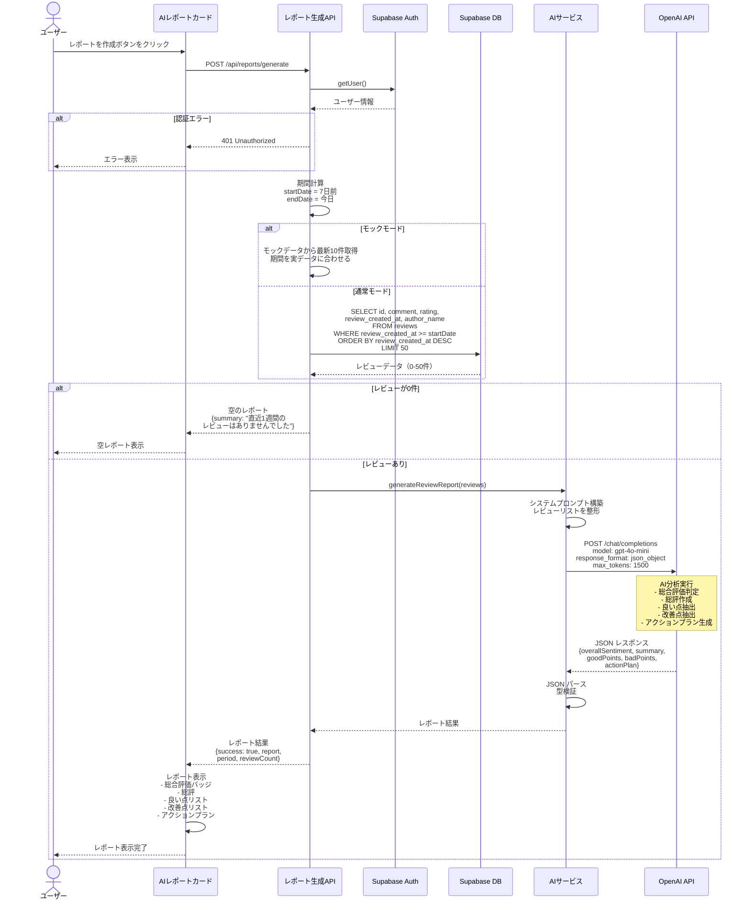

# 週間レポート生成フロー (Weekly Report Flow)

## 概要

直近7日間のレビューをOpenAI API (gpt-4o-mini) で分析し、店舗オーナー向けの週間レポートを生成するシーケンス図です。ハルシネーション防止のため、DB側で期間フィルタリングを行います。

## 関連ファイル

- [`app/api/reports/generate/route.ts`](../../app/api/reports/generate/route.ts) - レポート生成APIエンドポイント
- [`lib/services/ai.ts`](../../lib/services/ai.ts) - generateReviewReport関数
- [`components/dashboard/ai-report-card.tsx`](../../components/dashboard/ai-report-card.tsx) - レポートUIコンポーネント

## アーキテクチャ図

```mermaid
graph TB
    User[ユーザー]
    AIReportCard[AIReportCard<br/>コンポーネント]
    ReportAPI[/api/reports/generate<br/>APIルート]
    Supabase[(Supabase DB<br/>reviews テーブル)]
    AIService[AIサービス<br/>generateReviewReport]
    OpenAI[OpenAI API<br/>gpt-4o-mini]

    User -->|レポート作成ボタンをクリック| AIReportCard
    AIReportCard -->|POST /api/reports/generate| ReportAPI
    ReportAPI -->|直近7日間のレビューを取得<br/>.gte review_created_at 7日前| Supabase
    Supabase -->|レビューデータ 0-50件| ReportAPI
    ReportAPI -->|レビューあり| AIService
    AIService -->|レビューリストを分析| OpenAI
    OpenAI -->|レポート結果<br/>総合評価 総評 良い点 改善点<br/>アクションプラン| AIService
    AIService -->|レポート結果| ReportAPI
    ReportAPI -->|レポート結果 期間 件数| AIReportCard
    AIReportCard -->|レポート表示| User

    style User fill:#e1f5ff
    style AIReportCard fill:#fff4e1
    style ReportAPI fill:#ffe1e1
    style Supabase fill:#e1ffe1
    style AIService fill:#f0e1ff
    style OpenAI fill:#ffe1f0
```

## シーケンス図



## 処理フロー詳細

### 1. レポート生成API呼び出し

```typescript
// app/api/reports/generate/route.ts
export async function POST() {
  // 1. 認証チェック
  const supabase = await createClient();
  const { data: { user }, error: authError } = await supabase.auth.getUser();
  
  if (authError || !user) {
    return NextResponse.json({
      success: false,
      error: '認証が必要です',
    }, { status: 401 });
  }
  
  // 2. 期間計算（現在時刻から7日前）
  const endDate = new Date();
  const startDate = new Date();
  startDate.setDate(startDate.getDate() - 7);
  
  // 3. レビューデータを取得（DB側で期間フィルタリング）
  const { data, error } = await supabase
    .from('reviews')
    .select('id, comment, rating, review_created_at, author_name')
    .gte('review_created_at', startDate.toISOString())
    .order('review_created_at', { ascending: false })
    .limit(50); // トークン制限対策
  
  const reviews = data || [];
  
  // 4. レビューが0件の場合
  if (reviews.length === 0) {
    return NextResponse.json({
      success: true,
      report: {
        overallSentiment: 'neutral',
        summary: '直近1週間のレビューはありませんでした。',
        goodPoints: [],
        badPoints: [],
        actionPlan: '新しいレビューが投稿されるのを待ちましょう。',
      },
      period: { startDate: startDate.toISOString(), endDate: endDate.toISOString() },
      reviewCount: 0,
    });
  }
  
  // 5. AI分析を実行
  const reviewsForAI = reviews.map(r => ({
    text: r.comment || '',
    rating: r.rating,
    date: new Date(r.review_created_at),
  }));
  
  const reportResult = await generateReviewReport(reviewsForAI);
  
  return NextResponse.json({
    success: true,
    report: reportResult,
    period: { startDate: startDate.toISOString(), endDate: endDate.toISOString() },
    reviewCount: reviews.length,
  });
}
```

### 2. AI レポート生成処理

```typescript
// lib/services/ai.ts
export async function generateReviewReport(
  reviews: Array<{ text: string; rating: number; date: Date }>
): Promise<WeeklyReportResult> {
  const apiKey = process.env.OPENAI_API_KEY;
  
  if (!apiKey) {
    throw new Error('OPENAI_API_KEYが設定されていません');
  }
  
  const openai = new OpenAI({ apiKey });
  
  // システムプロンプト
  const systemPrompt = `あなたは店舗コンサルタントです。入力されたレビューリスト（直近1週間分）を読み、店舗オーナー向けの簡潔なレポートを作成してください。

以下のJSON形式で結果を返してください：

{
  "overallSentiment": "positive | neutral | negative （全体的な評価傾向）",
  "summary": "1週間の総評（100文字程度）",
  "goodPoints": ["良かった点1", "良かった点2", ...],
  "badPoints": ["改善点1", "改善点2", ...],
  "actionPlan": "来週に向けた具体的なアクション（1つ）"
}

ガイドライン:
- overallSentiment: 平均評価が4以上ならpositive、3以上ならneutral、それ以下ならnegative
- summary: 全体的な傾向を簡潔にまとめる
- goodPoints: 顧客から評価された点を2-3個抽出（配列）
- badPoints: 改善が必要な点を2-3個抽出（配列）。なければ空配列
- actionPlan: 具体的で実行可能なアクションを1つ提案`;
  
  // レビューリストを整形
  const reviewsText = reviews.map((r, idx) => 
    `${idx + 1}. [★${r.rating}] ${r.text}`
  ).join('\n\n');
  
  const userPrompt = `以下は直近1週間のレビューです（全${reviews.length}件）：

${reviewsText}`;
  
  const completion = await openai.chat.completions.create({
    model: 'gpt-4o-mini',
    messages: [
      { role: 'system', content: systemPrompt },
      { role: 'user', content: userPrompt },
    ],
    response_format: { type: 'json_object' },
    temperature: 0.7,
    max_tokens: 1500,
  });
  
  const responseContent = completion.choices[0]?.message?.content;
  const parsed = JSON.parse(responseContent);
  
  // 型検証とデフォルト値の設定
  return {
    overallSentiment: ['positive', 'neutral', 'negative'].includes(parsed.overallSentiment) 
      ? parsed.overallSentiment 
      : 'neutral',
    summary: String(parsed.summary || 'レポートを生成できませんでした'),
    goodPoints: Array.isArray(parsed.goodPoints) ? parsed.goodPoints : [],
    badPoints: Array.isArray(parsed.badPoints) ? parsed.badPoints : [],
    actionPlan: String(parsed.actionPlan || '引き続き顧客満足度の向上に努めましょう'),
  };
}
```

## 重要なポイント

### 1. ハルシネーション防止

**問題**: AIに期間判断をさせると、存在しないデータを生成する可能性がある

**解決策**: DB側で期間フィルタリングを行い、AIには既にフィルタリング済みのデータのみを渡す

```typescript
// ✅ 正しい実装: DB側でフィルタリング
const { data } = await supabase
  .from('reviews')
  .select('*')
  .gte('review_created_at', startDate.toISOString())
  .order('review_created_at', { ascending: false })
  .limit(50);

// ❌ 間違った実装: AIに期間判断をさせる
const allReviews = await supabase.from('reviews').select('*');
// AIに「直近7日間のレビューを分析して」と指示
```

### 2. トークン制限対策

OpenAI APIには入力トークン数の制限があるため、最大50件に制限します。

```typescript
.limit(50) // トークン制限対策
```

**トークン数の目安**:
- 1レビュー平均: 100-200トークン
- 50件: 5,000-10,000トークン
- gpt-4o-miniの制限: 128,000トークン（十分な余裕）

### 3. 0件対応

レビューが0件の場合、AIを呼び出さずに適切なメッセージを返します。

```typescript
if (reviews.length === 0) {
  return {
    overallSentiment: 'neutral',
    summary: '直近1週間のレビューはありませんでした。',
    goodPoints: [],
    badPoints: [],
    actionPlan: '新しいレビューが投稿されるのを待ちましょう。',
  };
}
```

### 4. モックモード対応

開発・テスト時にOpenAI APIを呼び出さずにテストできます。

```typescript
const USE_MOCK_DATA = process.env.NEXT_PUBLIC_USE_MOCK_DATA === 'true';

if (USE_MOCK_DATA) {
  // モックデータから最新10件を取得
  reviews = mockReviews.slice(0, 10).map(r => ({
    id: r.id,
    comment: r.text,
    rating: r.rating,
    review_created_at: r.date.toISOString(),
    author_name: r.authorName,
  }));
  
  // 期間を実際のモックデータの範囲に合わせる
  const dates = reviews.map(r => new Date(r.review_created_at));
  startDate.setTime(Math.min(...dates.map(d => d.getTime())));
  endDate.setTime(Math.max(...dates.map(d => d.getTime())));
}
```

## エラーハンドリング

### OpenAI APIキー未設定

```typescript
if (!apiKey) {
  throw new Error('OPENAI_API_KEYが設定されていません');
}
```

### OpenAI APIエラー

```typescript
if (error instanceof OpenAI.APIError) {
  if (error.status === 401) {
    throw new Error('OpenAI APIキーが無効です');
  } else if (error.status === 429) {
    throw new Error('OpenAI APIのレート制限に達しました');
  }
}
```

### DB取得エラー

```typescript
if (error) {
  return NextResponse.json({
    success: false,
    error: `レビューの取得に失敗しました: ${error.message}`,
  }, { status: 500 });
}
```

## レポート結果の構造

### WeeklyReportResult 型

```typescript
export interface WeeklyReportResult {
  overallSentiment: 'positive' | 'neutral' | 'negative';
  summary: string;
  goodPoints: string[];
  badPoints: string[];
  actionPlan: string;
}
```

### 総合評価の判定基準

| 総合評価 | 条件 | 説明 |
|---------|------|------|
| **positive** | 平均評価 ≥ 4.0 | 全体的に好評 |
| **neutral** | 3.0 ≤ 平均評価 < 4.0 | 普通 |
| **negative** | 平均評価 < 3.0 | 改善が必要 |

### レポート例

```json
{
  "overallSentiment": "positive",
  "summary": "今週は全体的に高評価が多く、特に接客とサービスの質が評価されています。一方で、待ち時間に関する指摘が数件ありました。",
  "goodPoints": [
    "スタッフの対応が丁寧で親切",
    "料理の味が美味しい",
    "店内の雰囲気が良い"
  ],
  "badPoints": [
    "ピーク時の待ち時間が長い",
    "価格が少し高め"
  ],
  "actionPlan": "ピーク時のスタッフ配置を見直し、待ち時間の短縮を図る"
}
```

## UIでの表示

### 集計期間の表示

```typescript
// components/dashboard/ai-report-card.tsx
const formatPeriod = (period: Period) => {
  const start = new Date(period.startDate);
  const end = new Date(period.endDate);
  return `${format(start, 'yyyy/MM/dd')} 〜 ${format(end, 'yyyy/MM/dd')}`;
};
```

### 総合評価バッジ

```typescript
const getSentimentBadge = (sentiment: 'positive' | 'neutral' | 'negative') => {
  switch (sentiment) {
    case 'positive':
      return <Badge className="bg-green-100 text-green-800">良好</Badge>;
    case 'neutral':
      return <Badge className="bg-blue-100 text-blue-800">普通</Badge>;
    case 'negative':
      return <Badge className="bg-red-100 text-red-800">要改善</Badge>;
  }
};
```

## パフォーマンス最適化

### 1. 必要なカラムのみ取得

```typescript
.select('id, comment, rating, review_created_at, author_name')
// 全カラムではなく、必要なカラムのみ
```

### 2. インデックスの活用

```sql
CREATE INDEX idx_reviews_created_at ON reviews(review_created_at DESC);
```

### 3. キャッシュ（将来の改善案）

同じ期間のレポートを複数回生成する場合、結果をキャッシュします。

```typescript
// Redis等でキャッシュ
const cacheKey = `report:${userId}:${startDate}:${endDate}`;
const cached = await redis.get(cacheKey);
if (cached) return JSON.parse(cached);
```

## 関連ドキュメント

- [AI分析フロー](./03_AI_ANALYSIS_FLOW.md) - 単一レビューの分析
- [モックモードガイド](../MOCK_MODE_GUIDE.md) - モックモードの詳細
