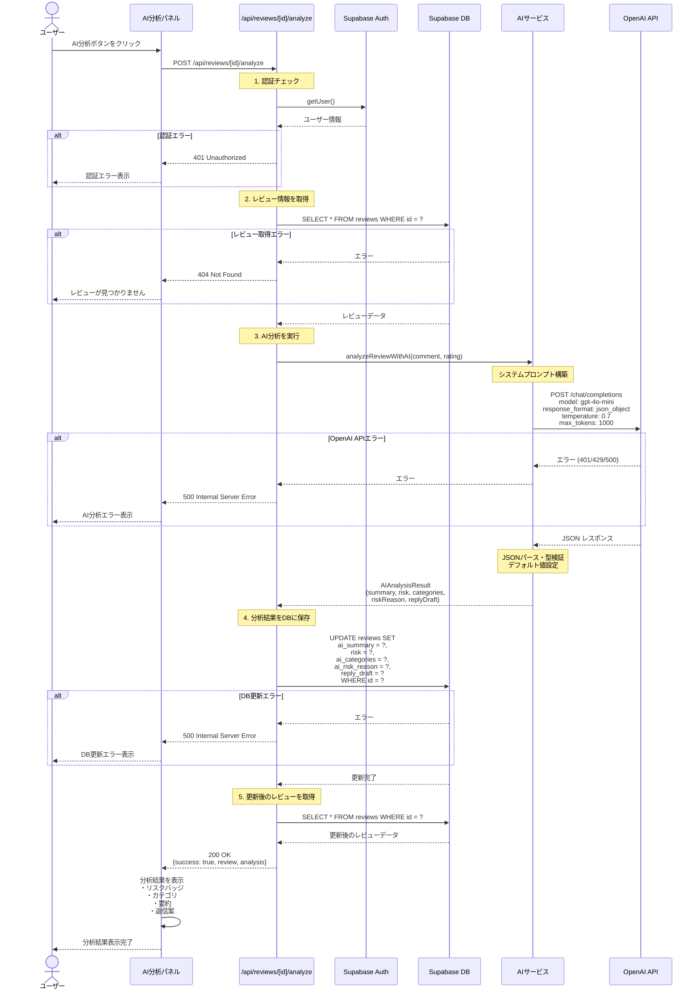

# AI分析機能 シーケンス図

## 概要

個別レビューをOpenAI API (gpt-4o-mini) で自動分析し、リスクレベル、カテゴリ分類、返信案を生成する機能のシーケンス図です。

## 関連ファイル

- [`app/api/reviews/[id]/analyze/route.ts`](../../app/api/reviews/[id]/analyze/route.ts) - AI分析APIエンドポイント
- [`lib/services/ai.ts`](../../lib/services/ai.ts) - OpenAI API呼び出し（analyzeReviewWithAI関数）
- [`lib/api/reviews-db.ts`](../../lib/api/reviews-db.ts) - DB更新処理
- [`components/reviews/ai-panel.tsx`](../../components/reviews/ai-panel.tsx) - AI分析UIコンポーネント

## シーケンス図



## 処理フロー詳細

### 1. 認証チェック

```typescript
// app/api/reviews/[id]/analyze/route.ts
const supabase = await createClient();
const { data: { user }, error: authError } = await supabase.auth.getUser();

if (authError || !user) {
  return NextResponse.json({
    success: false,
    error: '認証が必要です',
  }, { status: 401 });
}
```

### 2. レビュー情報の取得

```typescript
// lib/api/reviews-db.ts
const review = await getReviewFromDb(id, supabase);
```

DBから対象レビューを取得します。存在しない場合は404エラーを返します。

### 3. AI分析の実行

```typescript
// lib/services/ai.ts
const analysisResult = await analyzeReviewWithAI(
  review.comment || '',
  review.rating
);
```

**システムプロンプト**:
- ベテラン店長の役割でレビューを分析
- JSON形式でのレスポンス
- 要約（50文字以内）
- リスクレベル（high/medium/low）
- カテゴリ（接客、味、価格、雰囲気、提供スピード）
- リスク理由（30文字以内）
- 返信案

**API設定**:
- Model: `gpt-4o-mini`
- Response format: `json_object`
- Temperature: `0.7`
- Max tokens: `1000`

### 4. 分析結果の保存

```typescript
// lib/api/reviews-db.ts
await updateReviewAnalysisInDb(id, analysisResult, supabase);
```

分析結果を`reviews`テーブルに保存します:
- `ai_summary`: 要約
- `risk`: リスクレベル
- `ai_categories`: カテゴリ配列
- `ai_risk_reason`: リスク理由
- `reply_draft`: 返信案

### 5. レスポンスの返却

```typescript
return NextResponse.json({
  success: true,
  review: updatedReview,
  analysis: analysisResult,
});
```

## AI分析結果の構造

### AIAnalysisResult 型

```typescript
export interface AIAnalysisResult {
  summary: string;           // 50文字以内の要約
  risk: 'high' | 'medium' | 'low';
  categories: string[];      // カテゴリ配列
  riskReason: string;        // 30文字以内のリスク理由
  replyDraft: string;        // 返信案
}
```

### リスクレベルの判定基準

| リスクレベル | 条件 | 例 |
|------------|------|---|
| **high** | ★1-2 かつ強い不満表現、再訪意向の喪失 | 「二度と行きません」「最悪でした」 |
| **medium** | ★3 または具体的な改善要望 | 「少し待たされた」「値段が高い」 |
| **low** | ★4-5 または具体的な問題なし | 「美味しかった」「また来たい」 |

### カテゴリ分類

以下の5つのカテゴリから複数選択可能:
- **接客**: スタッフの対応、サービス
- **味**: 料理の味、品質
- **価格**: コストパフォーマンス
- **雰囲気**: 店内の雰囲気、清潔感
- **提供スピード**: 料理の提供時間、待ち時間

## エラーハンドリング

### 認証エラー (401)

```typescript
if (authError || !user) {
  return NextResponse.json({
    success: false,
    error: '認証が必要です',
  }, { status: 401 });
}
```

### レビュー取得エラー (404)

```typescript
if (!review) {
  return NextResponse.json({
    success: false,
    error: 'レビューが見つかりません',
  }, { status: 404 });
}
```

### OpenAI APIエラー (500)

```typescript
if (error instanceof OpenAI.APIError) {
  if (error.status === 401) {
    throw new Error('OpenAI APIキーが無効です');
  } else if (error.status === 429) {
    throw new Error('OpenAI APIのレート制限に達しました');
  } else if (error.status === 500) {
    throw new Error('OpenAI APIでエラーが発生しました');
  }
}
```

### DB更新エラー (500)

```typescript
if (dbError) {
  return NextResponse.json({
    success: false,
    error: 'DB更新に失敗しました',
  }, { status: 500 });
}
```

## UIコンポーネント

### AI分析パネル

**ファイル**: `components/reviews/ai-panel.tsx`

**表示内容**:
- AI分析実行ボタン
- ローディング状態
- 分析結果:
  - リスクレベルバッジ（high: 赤、medium: 黄、low: 緑）
  - カテゴリタグ
  - 要約テキスト
  - リスク理由
  - 返信案テキストエリア
- エラーメッセージ
- 再分析ボタン

## 重要なポイント

### 1. JSON形式でのレスポンス

OpenAI APIに`response_format: { type: 'json_object' }`を指定することで、確実にJSON形式のレスポンスを取得します。

### 2. 型検証とデフォルト値

AIのレスポンスが期待通りでない場合に備えて、型検証とデフォルト値を設定します:

```typescript
result = {
  summary: String(parsed.summary || '分析結果を取得できませんでした').substring(0, 50),
  risk: ['high', 'medium', 'low'].includes(parsed.risk) ? parsed.risk : 'medium',
  categories: Array.isArray(parsed.categories) ? parsed.categories : [],
  riskReason: String(parsed.riskReason || '').substring(0, 30),
  replyDraft: String(parsed.replyDraft || 'ご利用ありがとうございました。'),
};
```

### 3. 文字数制限

UIでの表示を考慮して、要約とリスク理由に文字数制限を設けます:
- 要約: 50文字以内
- リスク理由: 30文字以内

### 4. データ保存先

AI分析結果は`reviews`テーブルに直接保存されます。別テーブル（`analyzed_reviews`など）は使用しません。

## パフォーマンス最適化

### 1. トークン数の最適化

```typescript
max_tokens: 1000, // 必要最小限に設定
```

### 2. キャッシュの活用（将来の改善案）

同じレビューに対する再分析を防ぐため、既に分析済みの場合はキャッシュされた結果を返します:

```typescript
// 既にAI分析済みの場合はスキップ
if (review.ai_summary) {
  return { success: true, cached: true, analysis: review };
}
```

## 関連ドキュメント

- [週間レポート生成フロー](./06_WEEKLY_REPORT_SEQUENCE.md) - 複数レビューの一括分析
- [AI分析フロー（詳細版）](./03_AI_ANALYSIS_FLOW.md) - より詳細な実装ドキュメント
