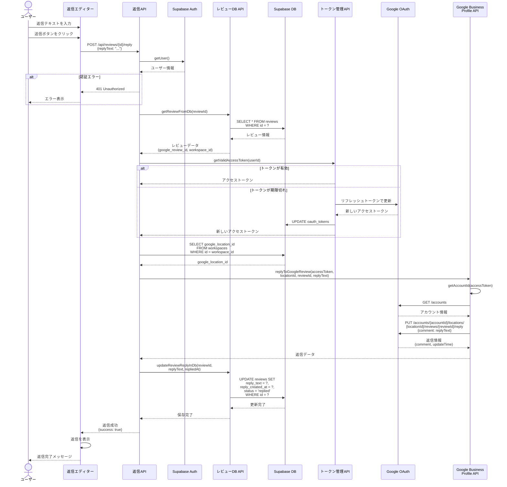
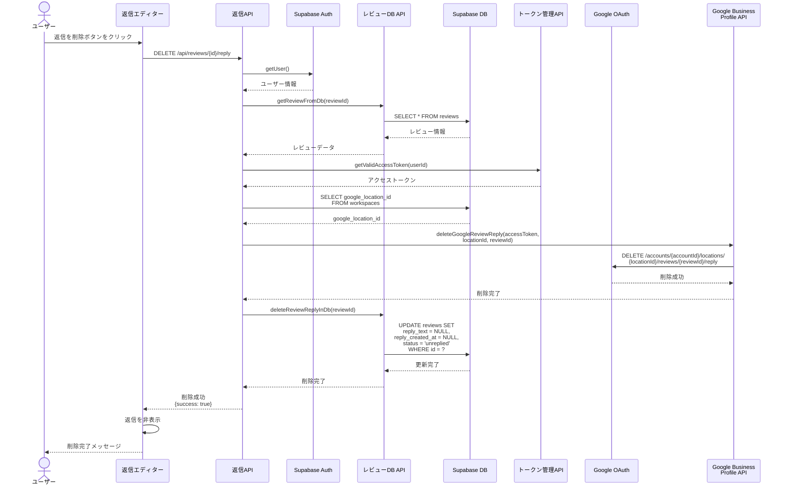

# レビュー返信フロー (Review Reply Flow)

## 概要

Google Business Profileのレビューへの返信投稿・削除のシーケンス図です。Google APIとSupabase DBの両方を更新し、データの整合性を保ちます。

## 関連ファイル

- [`app/api/reviews/[id]/reply/route.ts`](../../app/api/reviews/[id]/reply/route.ts) - レビュー返信APIエンドポイント
- [`lib/api/google-mybusiness.ts`](../../lib/api/google-mybusiness.ts) - Google Business Profile API呼び出し
- [`lib/api/reviews-db.ts`](../../lib/api/reviews-db.ts) - DB更新処理
- [`lib/api/tokens.ts`](../../lib/api/tokens.ts) - トークン管理
- [`components/reviews/reply-editor.tsx`](../../components/reviews/reply-editor.tsx) - 返信エディターUI

## アーキテクチャ図

```mermaid
graph TB
    User[ユーザー]
    ReplyEditorUI[返信エディター<br/>コンポーネント]
    ReplyAPI[/api/reviews/id/reply<br/>APIルート]
    ReviewsDB[レビューDB API<br/>getReviewFromDb<br/>updateReviewReplyInDb]
    TokensAPI[トークン管理API<br/>getValidAccessToken]
    DB[(Supabase DB<br/>reviews<br/>workspaces<br/>oauth_tokens)]
    GoogleOAuth[Google OAuth]
    GMBAPI[Google Business<br/>Profile API<br/>replyToGoogleReview]

    User -->|返信テキストを入力<br/>送信ボタンをクリック| ReplyEditorUI
    ReplyEditorUI -->|POST /api/reviews/id/reply| ReplyAPI
    ReplyAPI -->|レビュー情報を取得| ReviewsDB
    ReviewsDB -->|SELECT * FROM reviews| DB
    DB -->|レビューデータ| ReviewsDB
    ReviewsDB -->|レビューデータ| ReplyAPI
    ReplyAPI -->|アクセストークン取得| TokensAPI
    TokensAPI -->|SELECT * FROM oauth_tokens| DB
    TokensAPI -.->|期限切れの場合<br/>リフレッシュ| GoogleOAuth
    GoogleOAuth -.->|新しいアクセストークン| TokensAPI
    TokensAPI -->|アクセストークン| ReplyAPI
    ReplyAPI -->|ワークスペース情報取得| DB
    DB -->|google_location_id| ReplyAPI
    ReplyAPI -->|返信を投稿| GMBAPI
    GMBAPI -->|PUT /reviews/reviewId/reply| GoogleOAuth
    GoogleOAuth -->|返信情報| GMBAPI
    GMBAPI -->|返信データ| ReplyAPI
    ReplyAPI -->|返信情報を保存| ReviewsDB
    ReviewsDB -->|UPDATE reviews SET<br/>reply_text reply_created_at<br/>status replied| DB
    DB -->|更新完了| ReviewsDB
    ReviewsDB -->|保存完了| ReplyAPI
    ReplyAPI -->|返信成功| ReplyEditorUI
    ReplyEditorUI -->|返信を表示| User

    style User fill:#e1f5ff
    style ReplyEditorUI fill:#fff4e1
    style ReplyAPI fill:#ffe1e1
    style ReviewsDB fill:#e1ffe1
    style TokensAPI fill:#f0e1ff
    style DB fill:#e1ffe1
    style GoogleOAuth fill:#ffe1f0
    style GMBAPI fill:#ffe1f0
```

## シーケンス図

### 返信投稿フロー (POST)



### 返信削除フロー (DELETE)



## 処理フロー詳細

### 1. 返信投稿API (POST)

```typescript
// app/api/reviews/[id]/reply/route.ts
export async function POST(
  request: NextRequest,
  { params }: { params: Promise<{ id: string }> }
) {
  const { id } = await params;
  
  // 1. 認証チェック
  const supabase = await createClient();
  const { data: { user }, error: authError } = await supabase.auth.getUser();
  
  if (authError || !user) {
    return NextResponse.json({
      success: false,
      error: '認証が必要です',
    }, { status: 401 });
  }
  
  // 2. リクエストボディから返信テキストを取得
  const body = await request.json();
  const { replyText } = body;
  
  if (!replyText || replyText.trim() === '') {
    return NextResponse.json({
      success: false,
      error: '返信テキストが空です',
    }, { status: 400 });
  }
  
  // 3. レビュー情報を取得
  const review = await getReviewFromDb(id, supabase);
  
  // 4. アクセストークンを取得（自動リフレッシュ）
  const accessToken = await getValidAccessToken(user.id, supabase);
  
  // 5. ワークスペース情報からlocationIdを取得
  const { data: workspace } = await supabase
    .from('workspaces')
    .select('google_location_id')
    .eq('id', review.workspace_id)
    .single();
  
  // 6. Google Business Profile APIに返信を投稿
  const googleReply = await replyToGoogleReview(
    accessToken,
    workspace.google_location_id,
    review.google_review_id,
    replyText
  );
  
  // 7. DBに返信情報を保存
  await updateReviewReplyInDb(
    id,
    replyText,
    googleReply.updateTime,
    supabase
  );
  
  return NextResponse.json({
    success: true,
    reply: {
      text: replyText,
      createdAt: googleReply.updateTime,
    },
  });
}
```

### 2. Google Business Profile APIへの返信投稿

```typescript
// lib/api/google-mybusiness.ts
export async function replyToGoogleReview(
  accessToken: string,
  locationId: string,
  reviewId: string,
  replyText: string
): Promise<{ comment: string; updateTime: string }> {
  // アカウントIDを取得
  const accountId = await getAccountId(accessToken);
  
  // 返信を投稿
  const url = `https://mybusiness.googleapis.com/v4/${accountId}/${locationId}/reviews/${reviewId}/reply`;
  
  const response = await fetch(url, {
    method: 'PUT',
    headers: {
      Authorization: `Bearer ${accessToken}`,
      'Content-Type': 'application/json',
    },
    body: JSON.stringify({
      comment: replyText,
    }),
  });
  
  if (!response.ok) {
    throw new Error(`返信の投稿に失敗: ${response.status}`);
  }
  
  const data = await response.json();
  
  return {
    comment: data.comment,
    updateTime: data.updateTime,
  };
}
```

### 3. DBへの返信保存

```typescript
// lib/api/reviews-db.ts
export async function updateReviewReplyInDb(
  reviewId: string,
  replyText: string,
  repliedAt: string,
  supabase: SupabaseClient
): Promise<void> {
  const { error } = await supabase
    .from('reviews')
    .update({
      reply_text: replyText,
      reply_created_at: repliedAt,
      status: 'replied',
      updated_at: new Date().toISOString(),
    })
    .eq('id', reviewId);
  
  if (error) {
    throw new Error(`DB更新に失敗しました: ${error.message}`);
  }
}
```

### 4. 返信削除API (DELETE)

```typescript
// app/api/reviews/[id]/reply/route.ts
export async function DELETE(
  request: NextRequest,
  { params }: { params: Promise<{ id: string }> }
) {
  const { id } = await params;
  
  // 認証チェック、レビュー取得、トークン取得は同様
  
  // Google Business Profile APIから返信を削除
  await deleteGoogleReviewReply(
    accessToken,
    workspace.google_location_id,
    review.google_review_id
  );
  
  // DBから返信情報を削除
  await deleteReviewReplyInDb(id, supabase);
  
  return NextResponse.json({
    success: true,
  });
}
```

### 5. DBからの返信削除

```typescript
// lib/api/reviews-db.ts
export async function deleteReviewReplyInDb(
  reviewId: string,
  supabase: SupabaseClient
): Promise<void> {
  const { error } = await supabase
    .from('reviews')
    .update({
      reply_text: null,
      reply_created_at: null,
      status: 'unreplied',
      updated_at: new Date().toISOString(),
    })
    .eq('id', reviewId);
  
  if (error) {
    throw new Error(`DB更新に失敗しました: ${error.message}`);
  }
}
```

## 重要なポイント

### 1. Google APIとDBの両方を更新

返信はGoogle Business ProfileとSupabase DBの両方に保存されます。

**更新順序**:
1. Google Business Profile APIに返信を投稿
2. 成功したらDBに保存

**理由**: Google APIが失敗した場合、DBに不整合なデータを保存しないため

```typescript
// ✅ 正しい順序
await replyToGoogleReview(...); // 先にGoogle API
await updateReviewReplyInDb(...); // 成功したらDB

// ❌ 間違った順序
await updateReviewReplyInDb(...); // DBを先に更新
await replyToGoogleReview(...); // Google APIが失敗したら不整合
```

### 2. トークンの自動リフレッシュ

`getValidAccessToken()` により、期限切れのトークンを自動的にリフレッシュします。

```typescript
const accessToken = await getValidAccessToken(user.id, supabase);
// 5分のバッファを持ってトークンをチェック
// 期限切れの場合は自動的にリフレッシュ
```

### 3. エラーハンドリング

Google APIとDB更新のどちらかが失敗した場合、適切なエラーメッセージを返します。

```typescript
try {
  await replyToGoogleReview(...);
  await updateReviewReplyInDb(...);
} catch (error) {
  return NextResponse.json({
    success: false,
    error: error.message,
  }, { status: 500 });
}
```

### 4. バリデーション

返信テキストが空でないことを確認します。

```typescript
if (!replyText || replyText.trim() === '') {
  return NextResponse.json({
    success: false,
    error: '返信テキストが空です',
  }, { status: 400 });
}
```

## エラーハンドリング

### 認証エラー

```typescript
if (authError || !user) {
  return NextResponse.json({
    success: false,
    error: '認証が必要です',
  }, { status: 401 });
}
```

### レビューが見つからない

```typescript
try {
  const review = await getReviewFromDb(id, supabase);
} catch (error) {
  return NextResponse.json({
    success: false,
    error: 'レビューが見つかりませんでした',
  }, { status: 404 });
}
```

### トークン取得エラー

```typescript
try {
  const accessToken = await getValidAccessToken(user.id, supabase);
} catch (tokenError) {
  return NextResponse.json({
    success: false,
    error: 'アクセストークンの取得に失敗しました',
  }, { status: 401 });
}
```

### Google API エラー

```typescript
if (!response.ok) {
  if (response.status === 401) {
    throw new Error('認証エラー: アクセストークンが無効です');
  } else if (response.status === 403) {
    throw new Error('権限エラー: レビューへの返信権限がありません');
  } else if (response.status === 404) {
    throw new Error('レビューが見つかりません');
  }
  throw new Error(`返信の投稿に失敗: ${response.status}`);
}
```

### DB更新エラー

```typescript
if (error) {
  throw new Error(`DB更新に失敗しました: ${error.message}`);
}
```

## データの整合性

### トランザクション（将来の改善案）

Google APIとDB更新を1つのトランザクションとして扱うことで、データの整合性を保証できます。

```typescript
// 現在の実装
await replyToGoogleReview(...);
await updateReviewReplyInDb(...);

// 改善案: トランザクション
try {
  const googleReply = await replyToGoogleReview(...);
  await updateReviewReplyInDb(...);
} catch (error) {
  // Google APIが成功してDB更新が失敗した場合、
  // Google APIの返信を削除してロールバック
  await deleteGoogleReviewReply(...);
  throw error;
}
```

### 同期チェック

定期的にGoogle APIとDBのデータを比較し、不整合がないか確認します。

```typescript
// 定期実行（Cron job）
async function syncReviewReplies() {
  const reviews = await fetchAllReviews();
  
  for (const review of reviews) {
    const googleReview = await fetchGoogleReview(review.google_review_id);
    
    // DBとGoogle APIのデータを比較
    if (review.reply_text !== googleReview.reviewReply?.comment) {
      // 不整合を検出したら修正
      await updateReviewReplyInDb(review.id, googleReview.reviewReply?.comment);
    }
  }
}
```

## Google Business Profile API の制限

### レート制限

- **読み取り**: 1日あたり10,000リクエスト
- **書き込み**: 1日あたり1,000リクエスト

### 返信の制約

- 返信は1レビューにつき1回のみ
- 返信の編集は可能（PUTで上書き）
- 返信の削除は可能（DELETE）

## UIでの表示

### 返信エディター

```typescript
// components/reviews/reply-editor.tsx
const handleSubmit = async () => {
  setLoading(true);
  
  try {
    const response = await fetch(`/api/reviews/${reviewId}/reply`, {
      method: 'POST',
      headers: { 'Content-Type': 'application/json' },
      body: JSON.stringify({ replyText }),
    });
    
    if (!response.ok) {
      throw new Error('返信の投稿に失敗しました');
    }
    
    // 成功メッセージを表示
    toast.success('返信を投稿しました');
  } catch (error) {
    toast.error(error.message);
  } finally {
    setLoading(false);
  }
};
```

## 関連ドキュメント

- [レビュー同期フロー](./02_REVIEW_SYNC_FLOW.md) - レビューの取得と同期
- [認証フロー](./01_AUTHENTICATION_FLOW.md) - トークン管理
- [Google トークン管理](../GOOGLE_TOKEN_MANAGEMENT.md) - トークンリフレッシュの詳細
