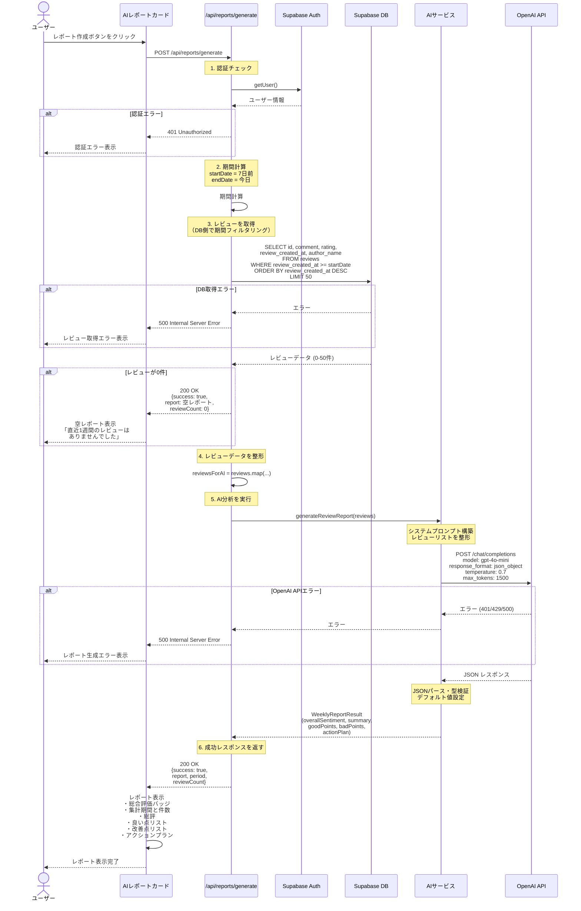

# 週間レポート生成機能 シーケンス図

## 概要

直近7日間のレビューをOpenAI API (gpt-4o-mini) で一括分析し、店舗オーナー向けの週間レポートを生成する機能のシーケンス図です。

## 関連ファイル

- [`app/api/reports/generate/route.ts`](../../app/api/reports/generate/route.ts) - レポート生成APIエンドポイント
- [`lib/services/ai.ts`](../../lib/services/ai.ts) - OpenAI API呼び出し（generateReviewReport関数）
- [`components/dashboard/ai-report-card.tsx`](../../components/dashboard/ai-report-card.tsx) - レポートUIコンポーネント

## シーケンス図



## 処理フロー詳細

### 1. 認証チェック

```typescript
// app/api/reports/generate/route.ts
const supabase = await createClient();
const { data: { user }, error: authError } = await supabase.auth.getUser();

if (authError || !user) {
  return NextResponse.json({
    success: false,
    error: '認証が必要です',
  }, { status: 401 });
}
```

### 2. 期間計算

```typescript
// 直近7日間の期間を計算
let endDate = new Date();
let startDate = new Date();
startDate.setDate(startDate.getDate() - 7);
```

### 3. レビューの取得（DB側で期間フィルタリング）

```typescript
const { data: reviews, error } = await supabase
  .from('reviews')
  .select('id, comment, rating, review_created_at, author_name')
  .gte('review_created_at', startDate.toISOString())
  .order('review_created_at', { ascending: false })
  .limit(50); // トークン制限対策
```

**重要**: ハルシネーション防止のため、DB側で期間フィルタリングを実施します。AIに期間判断をさせません。

### 4. レビューが0件の場合

```typescript
if (reviewList.length === 0) {
  return NextResponse.json({
    success: true,
    report: {
      overallSentiment: 'neutral',
      summary: '直近1週間のレビューはありませんでした。',
      goodPoints: [],
      badPoints: [],
      actionPlan: '新しいレビューが投稿されるのを待ちましょう。',
    },
    period: { startDate, endDate },
    reviewCount: 0,
  });
}
```

AIを呼び出さず、適切なメッセージを含む空レポートを返します。

### 5. レビューデータの整形

```typescript
const reviewsForAI = reviewList.map(r => ({
  text: r.comment || '',
  rating: r.rating,
  date: new Date(r.review_created_at),
}));
```

### 6. AI分析の実行

```typescript
// lib/services/ai.ts
const reportResult = await generateReviewReport(reviewsForAI);
```

**システムプロンプト**:
- 店舗コンサルタントの役割でレビューを分析
- JSON形式でのレスポンス
- 総合評価（positive/neutral/negative）
- 総評（100文字程度）
- 良かった点（2-3個）
- 改善点（2-3個）
- アクションプラン（1つ）

**API設定**:
- Model: `gpt-4o-mini`
- Response format: `json_object`
- Temperature: `0.7`
- Max tokens: `1500`

### 7. レスポンスの返却

```typescript
return NextResponse.json({
  success: true,
  report: reportResult,
  period: {
    startDate: startDate.toISOString(),
    endDate: endDate.toISOString(),
  },
  reviewCount: reviewList.length,
});
```

## レポート結果の構造

### WeeklyReportResult 型

```typescript
export interface WeeklyReportResult {
  overallSentiment: 'positive' | 'neutral' | 'negative';
  summary: string;
  goodPoints: string[];
  badPoints: string[];
  actionPlan: string;
}
```

### 総合評価の判定基準

| 総合評価 | 条件 | 説明 |
|---------|------|------|
| **positive** | 平均評価 ≥ 4.0 | 全体的に好評 |
| **neutral** | 3.0 ≤ 平均評価 < 4.0 | 普通 |
| **negative** | 平均評価 < 3.0 | 改善が必要 |

### レポート例

```json
{
  "overallSentiment": "positive",
  "summary": "今週は全体的に高評価が多く、特に接客とサービスの質が評価されています。一方で、待ち時間に関する指摘が数件ありました。",
  "goodPoints": [
    "スタッフの対応が丁寧で親切",
    "料理の味が美味しい",
    "店内の雰囲気が良い"
  ],
  "badPoints": [
    "ピーク時の待ち時間が長い",
    "価格が少し高め"
  ],
  "actionPlan": "ピーク時のスタッフ配置を見直し、待ち時間の短縮を図る"
}
```

## エラーハンドリング

### 認証エラー (401)

```typescript
if (authError || !user) {
  return NextResponse.json({
    success: false,
    error: '認証が必要です',
  }, { status: 401 });
}
```

### DB取得エラー (500)

```typescript
if (error) {
  return NextResponse.json({
    success: false,
    error: `レビューの取得に失敗しました: ${error.message}`,
  }, { status: 500 });
}
```

### OpenAI APIエラー (500)

```typescript
if (error instanceof OpenAI.APIError) {
  if (error.status === 401) {
    throw new Error('OpenAI APIキーが無効です');
  } else if (error.status === 429) {
    throw new Error('OpenAI APIのレート制限に達しました');
  } else if (error.status === 500) {
    throw new Error('OpenAI APIでエラーが発生しました');
  }
}
```

## UIコンポーネント

### AIレポートカード

**ファイル**: `components/dashboard/ai-report-card.tsx`

**表示内容**:
- レポート作成ボタン
- ローディング状態
- レポート結果:
  - 総合評価バッジ（positive: 緑、neutral: 青、negative: 赤）
  - 集計期間（開始日〜終了日）
  - レビュー件数
  - 総評テキスト
  - 良かった点リスト
  - 改善点リスト
  - アクションプラン
- エラーメッセージ

## 重要なポイント

### 1. ハルシネーション防止

**問題**: AIに期間判断をさせると、存在しないデータを生成する可能性がある

**解決策**: DB側で期間フィルタリングを行い、AIには既にフィルタリング済みのデータのみを渡す

```typescript
// ✅ 正しい実装: DB側でフィルタリング
const { data } = await supabase
  .from('reviews')
  .select('*')
  .gte('review_created_at', startDate.toISOString())
  .limit(50);

// ❌ 間違った実装: AIに期間判断をさせる
const allReviews = await supabase.from('reviews').select('*');
// AIに「直近7日間のレビューを分析して」と指示
```

### 2. トークン制限対策

OpenAI APIには入力トークン数の制限があるため、最大50件に制限します:

```typescript
.limit(50) // トークン制限対策
```

**トークン数の目安**:
- 1レビュー平均: 100-200トークン
- 50件: 5,000-10,000トークン
- gpt-4o-miniの制限: 128,000トークン（十分な余裕）

### 3. レビュー0件対応

レビューが0件の場合、AIを呼び出さずに適切なメッセージを返します:

```typescript
if (reviews.length === 0) {
  return {
    overallSentiment: 'neutral',
    summary: '直近1週間のレビューはありませんでした。',
    goodPoints: [],
    badPoints: [],
    actionPlan: '新しいレビューが投稿されるのを待ちましょう。',
  };
}
```

### 4. データ保存について

**重要**: 現在の実装では、レポートはデータベースに保存されていません。

- レポートは生成後、APIレスポンスとして返却されるのみ
- `weekly_reports`テーブルは存在しない
- レポートの履歴保存機能は未実装

将来的にレポート履歴を保存する場合、以下のようなテーブル構造が考えられます:

```sql
CREATE TABLE weekly_reports (
  id UUID PRIMARY KEY DEFAULT uuid_generate_v4(),
  workspace_id UUID NOT NULL REFERENCES workspaces(id),
  start_date TIMESTAMPTZ NOT NULL,
  end_date TIMESTAMPTZ NOT NULL,
  review_count INTEGER NOT NULL,
  overall_sentiment TEXT NOT NULL,
  summary TEXT NOT NULL,
  good_points TEXT[],
  bad_points TEXT[],
  action_plan TEXT NOT NULL,
  created_at TIMESTAMPTZ DEFAULT NOW()
);
```

## パフォーマンス最適化

### 1. 必要なカラムのみ取得

```typescript
.select('id, comment, rating, review_created_at, author_name')
// 全カラムではなく、必要なカラムのみ
```

### 2. インデックスの活用

```sql
CREATE INDEX idx_reviews_created_at ON reviews(review_created_at DESC);
```

`review_created_at`でのソートとフィルタリングを高速化します。

### 3. キャッシュの活用（将来の改善案）

同じ期間のレポートを複数回生成する場合、結果をキャッシュします:

```typescript
// Redis等でキャッシュ
const cacheKey = `report:${userId}:${startDate}:${endDate}`;
const cached = await redis.get(cacheKey);
if (cached) return JSON.parse(cached);

// レポート生成後にキャッシュ
await redis.setex(cacheKey, 3600, JSON.stringify(report)); // 1時間キャッシュ
```

## モックモード対応

開発・テスト時にOpenAI APIを呼び出さずにテストできます:

```typescript
const USE_MOCK_DATA = process.env.NEXT_PUBLIC_USE_MOCK_DATA === 'true';

if (USE_MOCK_DATA) {
  // 期間フィルタリングをスキップして最新50件を取得
  query = query.order('review_created_at', { ascending: false }).limit(50);
  
  // 期間を実際のモックデータの範囲に合わせる
  if (reviewList.length > 0) {
    const dates = reviewList.map(r => new Date(r.review_created_at));
    startDate = new Date(Math.min(...dates.map(d => d.getTime())));
    endDate = new Date(Math.max(...dates.map(d => d.getTime())));
  }
}
```

## 集計期間の表示

UIでの集計期間の表示例:

```typescript
const formatPeriod = (period: Period) => {
  const start = new Date(period.startDate);
  const end = new Date(period.endDate);
  return `${format(start, 'yyyy/MM/dd')} 〜 ${format(end, 'yyyy/MM/dd')}`;
};
```

## 関連ドキュメント

- [AI分析機能シーケンス図](./05_AI_ANALYSIS_SEQUENCE.md) - 単一レビューの分析
- [週間レポート生成フロー（詳細版）](./04_WEEKLY_REPORT_FLOW.md) - より詳細な実装ドキュメント
